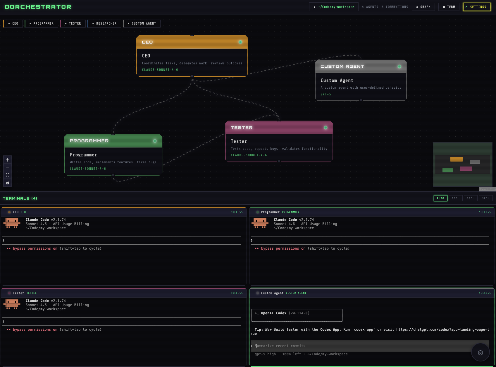

# Dorchestrator


A visual desktop application for orchestrating multiple AI agents — powered by **Claude Code** or **OpenAI Codex** — with real-time collaboration and inter-agent communication.




## Features

### Visual Agent Graph
- Drag-and-drop interface powered by React Flow
- Real-time node connections for defining agent relationships
- Color-coded agents with customizable roles and templates
- Interactive canvas with zoom, pan, and selection controls

### Integrated Terminals
- Live PTY sessions for each agent — choose between `claude` CLI or `codex` CLI per agent
- xterm.js terminals with full ANSI color support
- Auto-restart on session end
- Flexible layouts (auto, 1-col, 2-col, 3-col grid)
- Toggle views to focus on graph or terminals

### Multi-CLI Support
- Claude Code (`claude` CLI) — Anthropic's agentic terminal with full MCP support
- Codex (`codex` CLI) — OpenAI's agentic coding assistant running in full-auto mode
- Each agent independently chooses its CLI and model
- Mix Claude and Codex agents in the same workspace

### Voice Assistant
- Offline voice recognition using Whisper.cpp
- Real-time waveform visualization while recording
- Automatic transcription to focused terminal
- Keyboard shortcut (Cmd+Shift+V / Ctrl+Shift+V)
- Cyberpunk-styled UI with neon effects

### Inter-Agent Communication
- MCP-based messaging between connected agents (both Claude Code and Codex)
- TCP bridge server for reliable message routing
- Two-way communication with response capture
- Real-time streaming of agent responses
- Edge-aware tool discovery (agents only see connected peers)

### Agent Configuration
- Pre-built templates: CEO, Programmer, Tester, Researcher, Custom
- Terminal type selection: Claude Code or Codex per agent
- Model selection:
  - Claude: Opus 4.6, Sonnet 4.6, Haiku 4.5
  - Codex: gpt-5, o4-mini, o3, gpt-4.1, gpt-4o
- System prompts for role-specific instructions
- Persistent settings across sessions

### Workspace Management
- Folder-based workspaces for agent file access
- Launch-time workspace picker (blocks until set)
- Change workspace on-the-fly from header
- Shared working directory for all agents

## Quick Start

### Prerequisites
- macOS (Darwin)
- Node.js 16+
- **For Claude Code agents:** `claude` CLI installed and in PATH ([get it here](https://github.com/anthropics/claude-code))
- **For Codex agents:** `codex` CLI installed and in PATH ([get it here](https://github.com/openai/codex))
- Anthropic API key (for Claude Code agents)
- OpenAI API key (for Codex agents)
- **ffmpeg** (required for voice assistant): `brew install ffmpeg`

### Installation

```bash
# Clone the repository
git clone <your-repo-url>
cd agent-orchestrator

# Install dependencies
npm install

# The postinstall script will automatically rebuild node-pty for Electron
```

### Configuration

Create a `.env` file in the project root:

```env
# Claude Code agents
ANTHROPIC_API_KEY=your_anthropic_api_key_here
ANTHROPIC_BASE_URL=https://api.anthropic.com  # optional
CLAUDE_PATH=/path/to/claude                   # optional, defaults to 'claude' in PATH

# Codex agents
OPENAI_API_KEY=your_openai_api_key_here       # required for Codex agents
CODEX_PATH=/path/to/codex                     # optional, defaults to 'codex' in PATH
```

Or configure the Anthropic key via the UI after launch (Settings button in header).

### Development

```bash
# Start in development mode (hot reload)
npm run dev
```

This runs:
- Vite dev server on `http://localhost:3000`
- Electron app with DevTools open

### Production Build

```bash
# Build and package the app
npm run build
```

The packaged app will be in the `dist/` directory.

## Architecture

### Tech Stack
- **Electron** - Desktop app framework
- **React** - UI components and state management
- **React Flow** - Graph visualization and interaction
- **xterm.js** - Terminal emulation with PTY support
- **node-pty** - Pseudo-terminal spawning (native addon)
- **Anthropic SDK** - Fallback orchestrator (not used for PTY mode)

### Key Components

#### Main Process (`src/main/index.js`)
- PTY lifecycle management (spawn, resize, kill)
- Supports both `claude` and `codex` CLI per agent
- TCP bridge server for inter-agent messaging (Claude Code only)
- MCP config generation per agent
- Workspace and auth settings persistence
- IPC handlers for renderer communication

#### MCP Bridge (`src/main/mcp-bridge.js`)
- Stdio MCP server (newline-delimited JSON)
- Exposes `send_message` tool to connected agents (both Claude Code and Codex)
- Handles `initialize`, `tools/list`, `tools/call`
- Forwards messages via TCP to bridge server

#### Renderer Process (`src/renderer/`)
- **App.jsx** - Main layout, workspace picker, view toggles
- **GraphView** - React Flow canvas with agent nodes
- **TerminalGrid** - Multi-terminal layout manager
- **TerminalPanel** - Individual xterm.js terminal + PTY integration
- **AgentConfigPanel** - Agent settings sidebar (terminal type, model, etc.)

### Inter-Agent Communication Flow

```
CEO Terminal (PTY)
  ↓ uses MCP tool: send_message
MCP Bridge (stdio)
  ↓ TCP socket
Bridge Server (main process)
  ↓ writes to target PTY stdin (Claude Code) or spawns exec (Codex)
Target Agent Terminal (PTY)
  ↓ captures output
Bridge Server
  ↓ returns response
CEO Terminal (receives reply)
```

## Usage

### Creating Agents
1. Click "Add Agent" in the graph view
2. Select a template (CEO, Programmer, etc.) or create custom
3. Configure name, role, **terminal type** (Claude Code or Codex), model, and system prompt
4. Click "Save"

### Choosing Terminal Type

In the **Configure Agent** panel, select the **Terminal** field:

| Terminal | CLI | Models | MCP Support |
|----------|-----|--------|-------------|
| **Claude Code** | `claude` | Opus 4.6, Sonnet 4.6, Haiku 4.5 | Yes |
| **Codex (OpenAI)** | `codex` | gpt-5, o4-mini, o3, gpt-4.1, gpt-4o | Yes |

You can mix agent types in the same workspace — for example, use a Claude Code CEO to orchestrate other Claude agents while running a Codex agent for parallel tasks.

### Connecting Agents
1. Drag from one agent's handle to another
2. Connected agents can message each other via MCP tools
3. Edges are bidirectional (both agents see each other)

### Messaging Between Agents
In any agent's terminal:
```
> Send a message to the Programmer asking them to create a snake game
```

The agent will use the `send_message` MCP tool automatically if connected.

### Workspace Setup
- On first launch, you'll be prompted to select a workspace folder
- All agents run with this folder as their working directory
- Change workspace anytime via the folder button in the header

### View Controls
- **Graph Graph** - Toggle graph view on/off
- **Terminal Terminal** - Toggle terminal view on/off
- **Split handle** - Drag to resize graph/terminal ratio (when both visible)

### Using Voice Assistant

The voice assistant allows you to dictate commands directly to your focused terminal using offline speech recognition.

#### First-Time Setup

1. **Install ffmpeg** (if not already installed):
   ```bash
   brew install ffmpeg
   ```

2. **Launch the app** and look for the voice orb in the bottom-right corner

3. **Install Whisper.cpp** (one-time setup, ~5 minutes):
   - Click the voice orb
   - Click "Install Whisper.cpp"
   - Wait for compilation to complete
   - Requires: git, make, and C++ compiler (install with `xcode-select --install`)

4. **Download a model** (choose one):
   - **Tiny** (~75MB) - Fast, decent accuracy
   - **Base** (~150MB) - Recommended, good balance
   - **Small** (~500MB) - Better accuracy, slower

#### Recording Voice Commands

1. Click the voice orb or press **Cmd+Shift+V** (Mac) / **Ctrl+Shift+V** (Windows)
2. Speak your command clearly
3. Click again or press the shortcut to stop recording
4. Wait 2-5 seconds for processing
5. The transcribed text will be automatically sent to your focused terminal

#### Features

- Fully offline - No internet required after setup
- Real-time waveform - Visual feedback while recording
- Auto-injection - Text sent directly to focused terminal
- Keyboard shortcut - Quick access with Cmd+Shift+V

#### Troubleshooting

**"Audio conversion failed. Please install ffmpeg"**
- Install ffmpeg: `brew install ffmpeg`

**"Whisper binary not found"**
- Click the voice orb and install Whisper.cpp
- Ensure you have development tools: `xcode-select --install`

**"Model not found"**
- After installing Whisper.cpp, download a model (Base recommended)

**Transcription is slow**
- First transcription takes longer due to model loading
- Use a smaller model (Tiny or Base) for faster processing
- Processing typically takes 2-5 seconds

**Poor transcription accuracy**
- Speak clearly and closer to the microphone
- Reduce background noise
- Try the Small model for better accuracy

## Troubleshooting

### "agent-bridge failed" error
- Ensure `claude` CLI is installed and in PATH
- Check that MCP config files are being written (see console logs)
- Verify agents are connected in the graph before messaging

### Terminal not spawning
- Check main process logs: `[PTY] spawnPty called for...`
- For Claude Code agents: ensure `ANTHROPIC_API_KEY` is set
- For Codex agents: ensure `OPENAI_API_KEY` is set and `codex` is in PATH
- Try restarting the app

### Codex agent not starting
- Ensure `codex` CLI is installed: `npm install -g @openai/codex` (or per official docs)
- Verify `OPENAI_API_KEY` is set in `.env` or your environment
- Set `CODEX_PATH=/path/to/codex` in `.env` if `codex` is not in PATH

### node-pty build errors
```bash
# Manually rebuild node-pty for Electron
npx @electron/rebuild -f -w node-pty
```

### No response from target agent
- Check that the target agent's terminal is running (not exited)
- Increase idle timeout in `getAgentResponse()` if responses are slow
- Check bridge server logs: `[Bridge] Response captured...`

## License

MIT

## Acknowledgments

- [Anthropic](https://anthropic.com) for Claude API and CLI
- [OpenAI](https://openai.com) for Codex CLI
- [React Flow](https://reactflow.dev) for graph visualization
- [xterm.js](https://xtermjs.org) for terminal emulation


